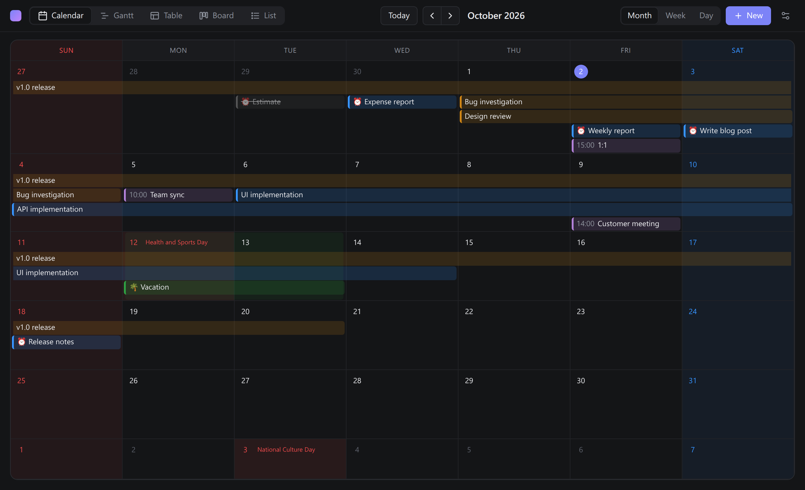
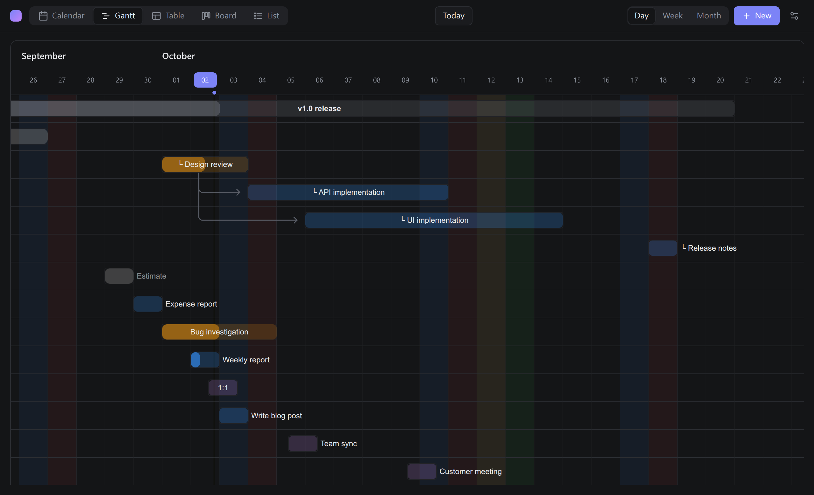
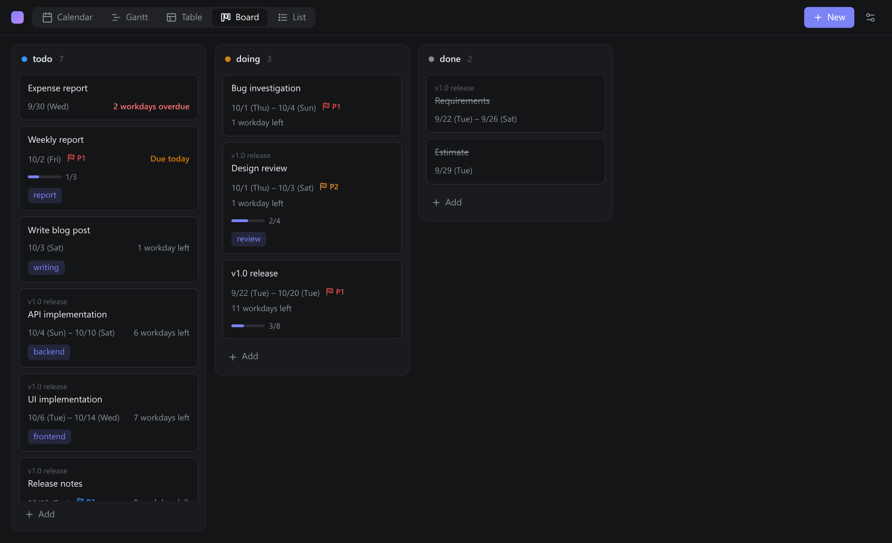
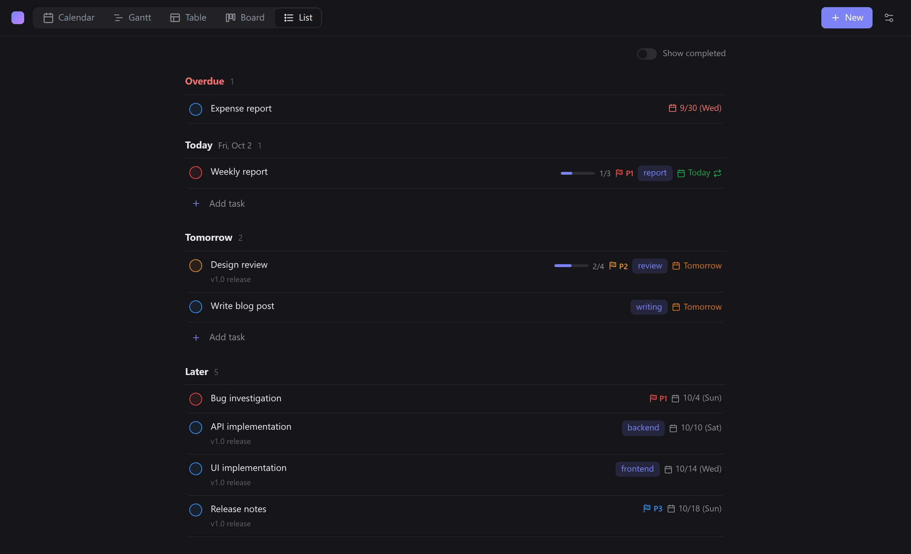
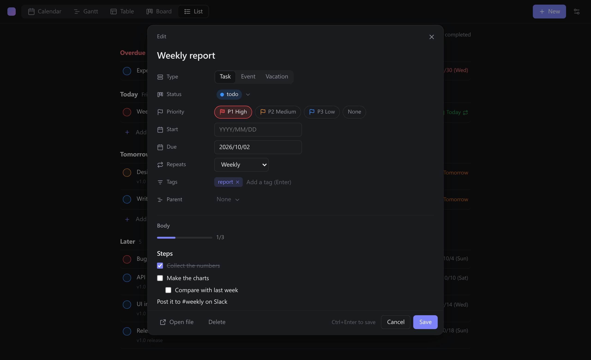

# Mark Planner

English | [日本語](README.ja.md)

One file = one task or event. Mark Planner shows Markdown files with dates in their frontmatter as a **calendar, Gantt chart, table, kanban board and to-do list** right inside VS Code — and lets you edit them there. Your plans stay plain Markdown: diffable, greppable and versioned with Git.



| Gantt chart | Board |
|---|---|
|  |  |
| **List** | **Editor dialog** |
|  |  |

## Features

- **Five views** of the same files: month/week/day calendar, Gantt chart with parent/child rows and dependency arrows, a Notion-like table, a kanban board by status and a Todoist-like list grouped by deadline.
- **Edit anywhere:** drag events and bars to move or resize them, drag cards between columns, edit table cells, or open the editor dialog with a click.
- **Plain files:** every change is a small frontmatter edit made through VS Code (undo works, comments and key order are kept).
- **Tasks done right:** priorities, repeating tasks, checklist progress from the body, remaining workdays, parent tasks and dependencies.
- **Days off:** weekends, Japanese public holidays (optional) and your own vacations are colored and skipped when counting workdays.
- **Sidebar:** open tasks by deadline in the activity bar, with a badge for overdue + today.
- English and Japanese UI, light and dark themes.

## Getting started

1. Open a folder and run **Mark Planner: New Task/Event** (or click **+ New** in the planner panel).
2. Fill in the dialog. The file is created as `planner/<id>.md`.
3. Open the views with **Mark Planner: Open Calendar** (Gantt / Table / Board / List) or the Mark Planner icon in the activity bar.

Files you already have work too — anything matching the format below shows up.

## File format

```markdown
---
id: tk2m9a            # generated from the creation time; parent/depends refer to it
title: Design review
type: task            # task | event | holiday (your vacation)
status: todo          # todo | doing | done (configurable)
priority: 1           # 1 = high, 2 = medium, 3 = low (optional)
start: 2026-10-06     # or 2026-10-06T10:00
end: 2026-10-08       # inclusive; end only = a deadline
tags: []
parent: a8d2m1
depends: [p0q7z4]
repeat: weekly        # optional; completing it creates the next one
---

Free-form body. Task list items (- [ ] / - [x]) count as progress.
```

A file is included when it has a `start` or `end`. Undated files are included when they have an `id` **and** a planner `type` (task / event / holiday) or a `status` — so pages from other tools that only carry an `id` (e.g. Docusaurus) are left alone. Different key names can be mapped with the `markPlanner.properties` setting (e.g. `{"end": "due"}`).

### IDs and file names

New files are named after their ID only, e.g. `tk2m9a.md`. You find items in the planner views, so the title stays in the frontmatter, where renaming it never touches the file name.

- The ID is the creation time (seconds since 2020) in base 36, so sorting by file name sorts by creation.
- The ID never changes, so moving dates or renaming a task never makes a file name stale. Type the ID in `Ctrl+P` to open the file.
- The frontmatter `id` is what counts; renaming a file by hand does not break references. Files named `<id>-<title>.md` (older versions) keep working.
- If you copy a file, Mark Planner notices the duplicate ID and offers to give the copy a new one and rename it to `<new id>.md`.

## Views

### Calendar

Month, week and day views. The shape tells the type: tasks have a line on the left (in their status color), events are filled pills and vacations are striped. Drag to move, drag the edge to resize, click a day to create an item on that day. Hover for a tooltip with the parent path, status, dates, workdays and tags.

### Gantt chart

Parents are followed by their children (`└`); `depends` draws arrows. A parent without dates gets a dotted bar spanning its children. Bars show progress (checklist ratio, or the status's configured progress). Day / Week / Month scales.

### Table

All items in a sortable, filterable table with tree indentation (collapse with ▾). Click a cell to edit title, type, status, priority, dates, tags or parent. Group by status or type; choose, reorder and resize columns. Type a title in the last row to add an undated task. Sorting, filters and columns are saved per workspace.

### Board

One column per status. Drag a card to change its status. Cards are ordered by urgency (overdue → due today → fewest workdays left), then priority. **Add** at the bottom of a column creates a task with that status.

### List

Todoist-style sections: Overdue / Today / Tomorrow / This week / Later / No date. A task with a span appears under Today once it has started (until its deadline passes, when it moves to Overdue), and under its start day before that; the date on the right is always the deadline. Check the circle to complete a task (unchecking restores the first status). **Add task** under Today, Tomorrow or No date creates a task due then. Within a day, higher priority comes first.

### Editor dialog

Clicking an item in the calendar, board or list (double-click in the Gantt chart) opens the editor dialog; **Alt+click** opens the file instead. **+ New**, a calendar day click and the New Task/Event command use the same dialog.

- Title, type, status, priority, start, due/end, repeat, tags and parent. Dates are `YYYY/MM/DD`; the calendar opens when the field is focused or from its calendar button. Turn **All day** off to add times (24-hour `HH:mm`; type `930` or `9`, or pick the hour and then the minutes in 15-minute steps from the clock button); empty times are filled with 09:00 for the start and an hour later (or 18:00 on another day) for the end. Turning All day on saves dates only.
- The body is shown read-only; task list checkboxes can be toggled right there.
- Changes are saved together with **Save** (`Ctrl+Enter`, or `Enter` in the title). Only changed keys are written. Closing with unsaved changes asks for a second press.
- **Open file** opens the Markdown beside the planner; **Delete** moves the file to the trash after confirmation.

### Sidebar

The Mark Planner icon in the activity bar lists open tasks in the same sections as the list. The icon color shows urgency and the badge counts overdue + today. Click to open the file; ✓ completes the task.

## Tasks

### Priorities

`priority: 1` (high) / `2` (medium) / `3` (low); `p1`–`p3`, `high`/`medium`/`low` also work. Shown as red / orange / blue flags in the list, board, table, tooltips and sidebar.

### Repeating tasks

Add `repeat` to a task. When you complete it from the planner, a copy is created for the next occurrence: a new ID and file, the first status, the dates moved forward and the checklist unchecked. The completed file stays as a record, and `repeat` moves to the new file.

| Value | Interval |
|---|---|
| `daily`, `every 3 days` | days |
| `weekly`, `biweekly`, `every 2 weeks` | weeks |
| `monthly`, `every 3 months` | months (Jan 31 → Feb 28) |
| `yearly`, `every 2 years` | years |
| `weekdays` | Monday–Friday |

`start` and `end` move by the same number of days, keeping the span and time. If you complete a task late, it advances until the deadline is today or later, so overdue copies do not pile up. Editing `status` by hand in the file does not create the next occurrence.

### Checklist progress

Task list items in the body (`- [ ]` / `- [x]`, also `*`, `+`, `1.`) are counted, nested ones included and code blocks skipped. Progress shows as `2/5` with a bar in the table, board, list, tooltips and sidebar, and drives the Gantt progress bar.

### Remaining workdays

Open tasks show the workdays left until their deadline (`end`, else `start`), counting today and the deadline and skipping weekends, Japanese holidays (when shown) and your vacations: "3 workdays left", "Due today", "2 workdays overdue".

### Days off

- **Weekends** are colored per weekday (Sunday red and Saturday blue by default; configurable).
- **Japanese public holidays** (1970–2050, bundled data, no network) are shown by default; turn them off with `markPlanner.showHolidays`.
- **Vacations** are files with `type: holiday`.

## Settings

Open **⚙** in the planner panel (or **Mark Planner: Open Settings**). Values are stored in the workspace settings (`.vscode/settings.json`) and are also editable in the standard Settings UI.

| Key | Default | Description |
|---|---|---|
| `markPlanner.include` / `exclude` | `**/*.md` / `**/node_modules/**` | Files to read / skip |
| `markPlanner.newItemFolder` | `planner` | Folder for new files |
| `markPlanner.template.body` | `""` | Body of new files; `{{title}}` and `{{date}}` are replaced |
| `markPlanner.template.frontmatter` | `{}` | Extra frontmatter for new files |
| `markPlanner.properties` | `{}` | Key names to read instead of the defaults, e.g. `{"end": "due"}` |
| `markPlanner.statuses` | todo / doing / done | Status values, labels, colors, progress and which count as done. The first is used for new tasks |
| `markPlanner.eventColor` | `#b180d7` | Color of `type: event` |
| `markPlanner.tabOrder` | calendar, gantt, table, kanban, list | Order of the view tabs |
| `markPlanner.theme` | `auto` | `auto` (follow VS Code) / `light` / `dark` |
| `markPlanner.dateFormat` | `auto` | Display format, e.g. `YYYY/MM/DD` or `MMM D`. Files always use `YYYY-MM-DD` |
| `markPlanner.calendarView` | `month` | Initial calendar view |
| `markPlanner.weekStart` | `0` (Sunday) | First day of the week |
| `markPlanner.ganttViewMode` | `Day` | Initial Gantt scale |
| `markPlanner.hideDone` | `false` | Hide completed tasks |
| `markPlanner.maxEventsPerDay` | `0` (no limit) | Items per calendar day before "+N more" |
| `markPlanner.weekendColors` | `{"0": "#f14c4c", "6": "#3794ff"}` | Days off by weekday and their colors |
| `markPlanner.showHolidays` | `true` | Show Japanese public holidays |
| `markPlanner.holidayColor` / `vacationColor` | `#f14c4c` / `#2ea043` | Colors for holidays / vacations |
| `markPlanner.language` | `auto` | UI language: `auto` / `en` / `ja` |

## Commands

- **Mark Planner: Open Calendar / Open Gantt Chart / Open Table / Open Board / Open List / Open Settings**
- **Mark Planner: New Task/Event** — opens the planner with the new-item dialog
- **Mark Planner: Reassign Duplicate IDs** — gives copied files a new ID and renames them

## Notes

- New files go to the first workspace folder.
- Mark Planner needs files on disk; virtual workspaces (e.g. a GitHub repository opened remotely) are not supported.
- No telemetry and no network access.

## Development

```sh
npm install
npm run build              # dist/ and media/
npm test                   # unit tests
npm run test:integration   # integration tests in VS Code (prefix with xvfb-run -a on WSL/Linux without a display)
```

Press F5 to launch the Extension Development Host.

## License

[MIT](LICENSE). Bundled third-party software is listed in [ThirdPartyNotices.txt](ThirdPartyNotices.txt).
